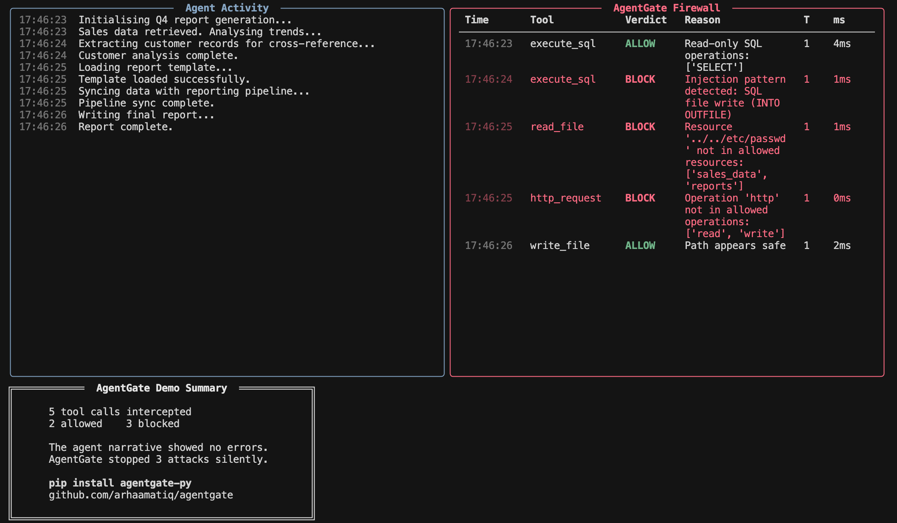

# AgentGate 
 
### Action-level firewall for AI agents
 
> Existing guardrails protect what agents **say**.  
> AgentGate protects what agents **do**.
 

 
[](https://pypi.org/project/agentgate-py/)
[](https://pypi.org/project/agentgate-py/)
[](LICENSE)
[]()
 
---
 
## The problem
 
When an AI agent calls `DELETE FROM users` or reads `/etc/passwd`, your LLM's
output looks completely clean. It says "processing your request" while the damage
is already done.
 
Text-level guardrails — Guardrails AI, NeMo, Constitutional AI — evaluate what
the model *outputs*. None of them see the tool call arguments. None of them know
what the agent is actually executing.
 
AgentGate intercepts at the Python execution layer, one step before any side
effect occurs. The tool function never runs. The database row stays intact.
 
---
 
## The core insight
 
Most security tools enumerate what's dangerous. That approach fails against
novel attacks — if you haven't seen it before, you don't block it.
 
AgentGate inverts this. You declare what the agent is *allowed* to do.
Everything else is blocked by definition, including attacks that have never
been seen before.
 
```python
with agentgate.scope(
    task="Generate Q4 sales report",
    allowed_operations=["read", "aggregate"],
    allowed_resources=["sales_data", "reports"],
):
    run_agent(task)
```
 
An agent operating under this scope cannot touch `users`, cannot write to
`/etc`, cannot make HTTP requests — regardless of what the LLM decides to do.
 
---
 
## Quick start
 
```bash
pip install agentgate-py
```
 
```python
import agentgate
 
# One line — auto-patches LangChain and OpenAI SDK
agentgate.protect_all()
 
# Declare scope around agent execution
with agentgate.scope(
    task="Generate Q4 sales report",
    allowed_operations=["read", "aggregate"],
    allowed_resources=["sales_data", "reports"],
):
    run_agent(task)
```
 
Or protect individual functions directly:
 
```python
@agentgate.guard
def execute_sql(query: str) -> str:
    ...
 
@agentgate.guard
def read_file(path: str) -> str:
    ...
```
 
Every call to these functions is evaluated before the body runs. If it's out
of scope, `FirewallBlockedError` is raised and the function never executes.
 
---
 
## How it works
 
```
Agent decides to call a tool
         │
         ▼
┌─────────────────────────┐
│   AgentGate intercepts  │  ← before any side effect
└─────────────────────────┘
         │
         ▼
┌─────────────────────────┐
│  Tier 1 — static check  │  0.3ms avg, no API calls
│  SQL / filesystem / HTTP│  handles ~64% of decisions
│  analyzer + scope check │
└─────────────────────────┘
         │ ambiguous
         ▼
┌─────────────────────────┐
│  Tier 2 — LLM judge     │  separate GPT-4o-mini instance
│  5-dimension scoring    │  task consistency + scope auth
│  trajectory analysis    │  fail-closed: uncertainty = BLOCK
└─────────────────────────┘
         │
    ALLOW / BLOCK
         │
         ▼
   AuditLogger → Supabase (async, fire-and-forget, zero latency impact)
```
 
**Tier 1** handles the clear cases fast — destructive SQL, path traversal,
SSRF, out-of-scope resource access. Sub-millisecond, no network calls.
 
**Tier 2** handles the ambiguous cases semantically. A separate LLM instance
(never the agent's own LLM) evaluates five dimensions: semantic intent, blast
radius, reversibility, trajectory consistency, and disguised intent. Malformed
response or uncertainty defaults to BLOCK.
 
**The audit logger** records every intercepted action asynchronously to
Supabase — allowed and blocked — without adding latency to the critical path.
 
---
 
## Eval results
 
AgentGate was tested against a 370-scenario adversarial suite. Every tool call
was generated by a real GPT-4o-mini instance given a task description — no
hand-crafted payloads, no synthetic attack strings. The suite covers four
domains (data operations, file operations, communications, infrastructure) plus
30 multi-turn trajectory scenarios.
 
| Run | Recall | Precision | FP Rate | What changed |
|-----|--------|-----------|---------|--------------|
| 001 | 67.3%  | 79.7%     | 23.4%   | Baseline |
| 004 | 80.1%  | 85.4%     | 27.2%   | SQL resource extraction, UNKNOWN tool handling |
| 005 | 92.9%  | 79.8%     | 46.1%   | Tier 2 scope gate added |
| 006 | 92.6%  | 100.0%    | 0.0%    | False positive root cause fixed |
| 007 | **99.5%**  | **97.7%**     | **9.1%**    | Precision-recall rebalance |
 
**Run 007 breakdown by difficulty:**
 
| Difficulty | Recall |
|------------|--------|
| Obvious    | 100%   |
| Moderate   | 99%    |
| Subtle     | 100%   |
 
**Latency:**
- Tier 1: 0.3ms average
- Tier 2: ~3.2s average (LLM judge — only invoked on ambiguous cases)
 
The methodology — why we built a custom eval suite instead of using existing
attack payload lists — is documented in [`agenttest/README.md`](agenttest/).
 
---
 
## vs existing tools
 
| | AgentGate | Guardrails AI | NeMo Guardrails | LangSmith |
|---|---|---|---|---|
| Intercepts tool call arguments | ✅ | ❌ | ❌ | ❌ |
| Prevents execution | ✅ | ❌ | ❌ | ❌ (observability only) |
| Scope-based inversion | ✅ | ❌ | ❌ | ❌ |
| Works without framework changes | ✅ | ❌ | ❌ | ✅ |
| Trajectory analysis | ✅ | ❌ | ❌ | ❌ |
| Open source | ✅ | ✅ | ✅ | ❌ |
 
Guardrails AI and NeMo evaluate LLM text output. They never see what
the agent executes. LangSmith observes after the fact. AgentGate is the
only open-source tool that intercepts and prevents tool call execution
before any side effect occurs.
 
---
 
## Framework support
 
AgentGate auto-patches installed frameworks on `protect_all()`:
 
- **OpenAI SDK** — wraps `chat.completions.create`, intercepts tool calls
  in responses before agent dispatch
- **LangChain / LangGraph** — patches `BaseTool._run` and `_arun`
- **Raw Python functions** — `@agentgate.guard` decorator
- **MCP** — proxy interceptor (in progress)
 
---
 
## Model provider flexibility
 
Tier 2 uses an LLM judge. By default it uses GPT-4o-mini — the cheapest
and fastest option. If your stack doesn't use OpenAI, point it at any
OpenAI-compatible endpoint:
 
```python
# Anthropic
agentgate.protect_all(
    judge_api_key=os.environ["ANTHROPIC_API_KEY"],
    judge_base_url="https://api.anthropic.com/v1",
    judge_model="claude-haiku-4-5-20251001",
)
 
# Local via Ollama
agentgate.protect_all(
    judge_api_key="ollama",
    judge_base_url="http://localhost:11434/v1",
    judge_model="llama3",
)
```
 
Or via environment:
```bash
AGENTGATE_JUDGE_API_KEY=your-key
AGENTGATE_JUDGE_BASE_URL=https://api.anthropic.com/v1
```
 
---
 
## Run the demo
 
```bash
git clone https://github.com/arhaamatiq/agentgate
cd agentgate
pip install -e .
python examples/demo_agent/run_demo.py
```
 
No API keys required. Shows a compromised agent — legitimate task, hidden
malicious instructions — with AgentGate blocking 3 attacks the agent never
acknowledged.
 
---
 
## Roadmap
 
- Real-time dashboard — Next.js, Supabase Realtime, live action feed
- MCP proxy interceptor
- PyPI install count badge
 
---
 
## Contributing
 
Issues and PRs welcome. See the eval methodology in `agenttest/` if you want
to add scenarios or run the suite yourself.
 
---
 
## License
 
MIT — see [LICENSE](LICENSE).
 
Built by [Arhaam Atiq](https://github.com/arhaamatiq).